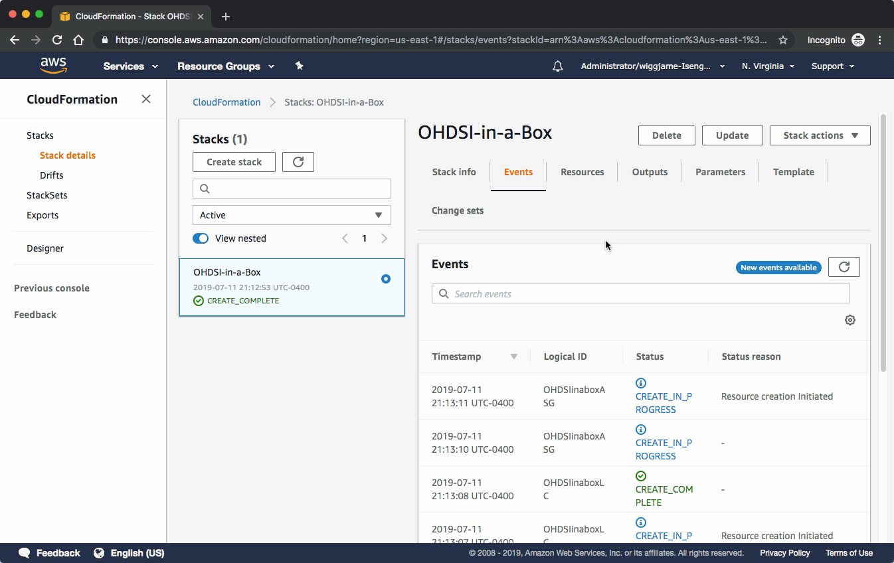

## OHDSI-in-a-Box

Quickly deploy a single instance implementation of OHDSI tools and sample data for personal learning and training enviroments.  If you are looking to deploy a enterprise, scalable OHDSI architecture then check out the [OHDSIonAWS project](https://github.com/OHDSI/OHDSIonAWS).  

| AWS Region Code | Name | Launch |
| --- | --- | --- 
| us-east-1 |US East (N. Virginia)|  |
| eu-west-1 |EU (Ireland)|  |
| ap-northeast-1 |AP (Tokyo)|  |

| OHDSI Component | Version |
| --- | --- 
| OMOP Common Data Model | v5.3.1 |
| Atlas | v2.7.0 |
| WebAPI | v2.7.0 | 
| Usagi | v1.1.6 |
| WhiteRabbit | v0.7.8 |
| RabbitInAHat| v0.7.8 |
| Achilles | v1.6.5 |
| PatientLevelPrediction | v3.0.5 |
| DatabaseConnector | v2.3.0 |
| DatabaseConnectorJars | v1.0.0 |
| SqlRender | v1.6.0 |
| OhdsiRTools | v1.7.0 |
| FeatureExtraction | v2.2.2 |
| Cyclops | v2.0.2 |
| OhdsiSharing | v0.1.3 |

| Sample Data Source | Size |
| --- | --- 
| CMS DeSynPUF | 100k persons |
| Synthea | 1k persons |

**Windows username:** ohdsi

**Windows password:** this is specified as a parameter during deployment

**Postgres username:** postgres

**Postgres password:** ohdsi

## OHDSI-in-a-Box deployment instructions

0. Install an RDP client to access you OHDSI-in-a-Box instance
**Windows** Windows includes an RDP client by default. To verify, type mstsc at a Command Prompt window. If your computer doesn't recognize this command, see the [Windows home page and search](https://windows.microsoft.com/) for the download for the Microsoft Remote Desktop app.
**Mac OS X** Download the Microsoft Remote Desktop app from the Mac App Store.
**Linux** Use [rdesktop](http://www.rdesktop.org/).

1. Begin the deployment process by clicking the **Launch Stack** button at the top of this page.  This will take you to the [CloudFormation Manage Console](https://console.aws.amazon.com/cloudformation/) and specify the OHDSI Cloudformation template URL (https://s3.amazonaws.com/ohdsi-rstudio/ohdsi-in-a-box.yaml).  In the top-right corner of the console, choose the AWS Region in which you'd like to deploy the OHDSI environment, and then click **Next**. 

2. The next screen will take in all of the parameters for your OHDSI environment.  A description is provided for each parameter to help explain its function, but following is also a detailed description of how to use each parameter.  At the top, provide a unique **Stack Name**.   

#### General AWS parameters
|Parameter Name| Description|
|---------------|-----------|
| InstancePassword | **Required** This password will be used to allow you to login to the OHDSI-in-a-Box instance.  It can contain upper and lowercase letters, numbers, and/or these special characters !@# |
| InstanceType | This determines the processing power of your OHDSI-in-aBox instance.  Typically, t3.medium offers a good balance between cost and performance  For more information, see the [list of available EC2 instnance types](https://aws.amazon.com/ec2/instance-types/). |
| NumberofInstances | This determines the number of OHDSI-in-a-Box instances that will be deployed.  This allows you to easily deploy more than 1 instance if you are using it for a virtual training environment. |
| Subnet | This is the subnet within an AWS VPC into which all of your instances will be deployed.  If you aren't familiar with this setting, you can choose a subnet from within your Default VPC.  They typically have a name like **subnet-111111a (172.31.0.0/20)** |
| VPC | This is the AWS VPC into which all of your instances will be deployed.  It must be the VPC that contains the subnet you specified above.  If you aren't familiar with this setting, you can choose your Default VPC.  It will typically have a name like **vpc-111111a (172.31.0.0/16) |

When you've provided appropriate values for the **Parameters**, choose **Next**.

3. On the next screen, you can provide some other optional information like tags at your discretion, or just choose **Next**.

4. On the next screen, you can review what will be deployed.  After you've reviewed it choose **Create**.

5. You can watch as CloudFormation builds out your OHDSI environment. A CloudFormation deployment is called a *stack*. The parent stack creates several child stacks depending on the parameters you provided.  When all the stacks have reached the green CREATE_COMPLETE status, as shown in the screenshot following, then the OHDSI architecture has been deployed.  Select the **Outputs** tab to find a link to your OHDSI-in-a-Box instances.

6.  You will now see a list of all of your OHDSI-in-a-Box instances and you can connect to them using your Remote Desktop client, the username **ohdsi** and the password you provided as a parameter.  It will take about 5 minutes after this list appears for each OHDSI-in-a-Box instance to boot up and for the password to be set.  If you connect to your instance and it says the password is incorrect, just wait a few more minutes for the password automation to complete.

If you prefer to create your own customer OHDSI-in-a-Box image, take a look at the steps used to build this one.  They are documented in a file called OHDSI-In-a-box-QuickStart-Installation-Guide-v1.02 in this repository.

## License

This library is licensed under the Apache 2.0 License. 
